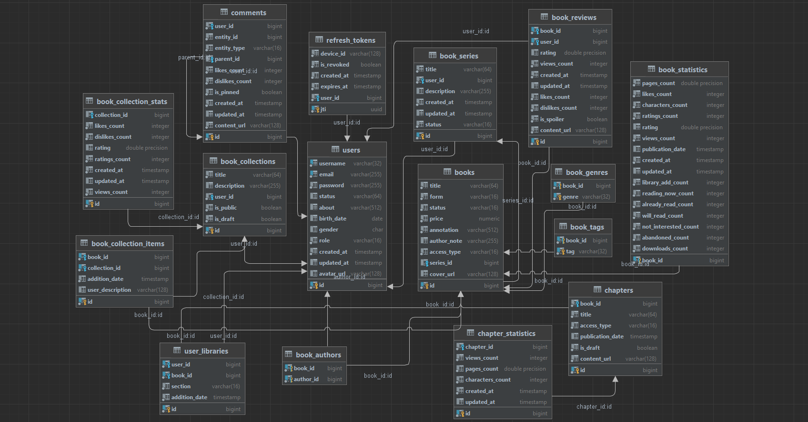

## Финальный проект для онлайн-курса «Java Enterprise» от компании СЕНЛА. Представляет собой RESTful API к веб-приложению для чтения книг. 
### Автор проекта: Ляшкевич Никита
Техническое задание к проекту: https://clck.ru/3LGCMU

##  Содержание
- [Стек технологий](#стек-технологий)
- [Описание проекта](#описание-проекта)
- [Структура проекта](#структура-проекта)
- [Схема базы данных](#схема-базы-данных)
- [Использованные паттерны](#использованные-паттерны)
- [Установка и запуск](#установка-и-запуск)
- [Тестирование работоспособности](#тестирование-работоспособности)


## Стек технологий

### Core
- Java 17
- Spring Boot 3.3.3 (Spring Data (JPA, JDBC, Redis, Elasticsearch), Spring AOP, Spring Security (JWT), Spring Web, Spring Test, Spring Validation)
- Maven
- Liquibase
- Swagger

### Storage
- PostgreSQL 15.6
- Redis 7.4
- MinIO (Хранилище объектов, аналог Amazon S3)
- Elasticsearch 7.17.24
- Kibana 7.17.24
- Logstash 7.17.24

### Testing
- JUnit 5
- Mockito
- AssertJ
- Testcontainers

### DevOps
- Docker
- Docker Compose

### Utilities
- MapStruct
- Lombok
- JJWT
- Jsoup

[К содержанию](#содержание)


## Описание проекта
Для создания проекта вдохновлялся сайтом [author.today](https://author.today), поэтому реализовал похожий функционал.
Есть возможность зарегистрироваться в приложении, войти в уже существующий аккаунт, выйти из него, изменить пароль, обновить токен доступа, используя
токен обновления, отозвать его. Помимо CRUD операций над пользователями, книгами, главами, подборками книг (collection),
книжными циклами (series), рецензиями, библиотеками пользователей, комментариями, можно также получать постраничный список
с возможностью фильтрации пользователей, книг, библиотек, подборок книг; глав и комментариев тоже, но без фильтрации,
т к она тут и не нужна; использовать полнотекстовый поиск с пагинацией по имени пользователя, названию книги и её аннотации
с трёкратным приоритетом для названия; названию подборки книг и его описанию с приоритетом аналогично книге; публиковать книги, главы,
подборки и циклы, закреплять и откреплять комментарии.

Не авторизованный пользователь может просматривать всё, но для создания,
обновления и удаления чего-либо нужно быть авторизованным. При создании пользователя, он получает роль "читатель". Чтобы получить
роль "автор" нужно создать книгу, но чтобы в токене доступа изменение роли отобразилось, его нужно обновить. Создавать 
и редактировать главы и книжные циклы, а также редактировать книги могут только авторы. Опубликовать книгу можно
только если опубликована хотя бы одна глава в этой книге, аналогично для цикла и подборки - только если хотя бы одна книга
в них опубликована. Все эти сущности при создании имеют статус черновика и только их автор может просматривать черновики.
Проверка доступа к сущностям также реализованна. При удалении аккаунта, выхода из него, отзыве токена и его 
обновлении идентификатор токенов добавляется в чёрный список Redis и в фильтре делается проверка есть ли токен в этом
списке, если да - 401.

Есть возможность добавлять и редактировать аватарки пользователей
и обложки книг, а также добавлять и редактировать медиа файлы к содержанию глав, рецензий, комментариев. Предполагается, что при добавлении
медиа файлов они сохраняются в MinIO и возвращается ссылка на них в хедере location, которая сразу отображает файл в браузере
(если бы это было приложение с фронтэндом), а так полученную ссылку можно вставить в адресную строку и увидеть содержимое.
Содержание глав, рецензий и комментариев в виде HTML передаётся как строка и также сохраняется в MinIO и возвращается ссылка на них.

[К содержанию](#содержание)


## Структура проекта
Проект является многомодульным и состоит из следующих модулей: web, service, repository. Web зависит от service, а он в свою
очередь от repository.
### Структура пакетов модуля repository:
- **config:** @Configuration классы для создания бинов через @Bean
- **document:** @Document сущности для Elasticsearch
- **dto:** DTO для фильтрации сущностей и для результатов этой фильтрации
- **entity:** @Entity сущности для Data JPA
- **enums:** все перечисления проекта
- **exception:** исключение, используемое при неверном указании поля для сортировки
- **projection:** Data JPA проекции
- **property:** @ConfigurationProperties классы-проперти
- **repository:** слой репозиториев для работы с БД. Состоит из четырёх подпакетов:
   - **criteria:** для реализации фильтрации с пагинацией через Criteria API
   - **elastic:** для работы с @Document
   - **jdbc:** для сохранения данных батчем через JdbcTemplate
   - **jpa:** стандартные Data JPA репозитории
- **util:** здесь находится класс-билдер для предикатов Criteria API
- **resources:** пакет ресурсов, где хранятся liquibase миграции, entrypoint и secrets для контейнеров БД 

### Структура пакетов модуля service: 
- **aspect:** аспект для логирования всего сервисного слоя
- **config:** @Configuration классы для создания бинов через @Bean
- **dto:** DTO для ответов на фронтэнд и для запросов с него же
- **event:** события для механизма слушателей событий
- **exception:** исключения, выбрасываемые в сервисном слое
- **mapper:** MupStruct мапперы для преобразования DTO в сущности и обратно
- **property:** @ConfigurationProperties классы-проперти
- **scheduler:** кроны для работы по расписанию
- **service:** состоит из двух подпакетов:
   - **impl:** тут находятся реализации сервисов - основная бизнес логика приложения
   - **interfaces:** тут находятся абстракции для сервисов
- **util:** утилитные классы
- **validation:** аннотации, валидаторы и группы для валидации входящих DTO 
- **resources:** пакет ресурсов, где хранятся конфиги для логирования

Unit тесты находятся в этом модуле.

### Структура пакетов модуля web: 
- **aspect:** аспекты для проверки доступа к данным
- **config:** @Configuration классы для создания бинов через @Bean
- **controller:** слой контроллеров
- **exceptionhandler:** @RestControllerAdvice для глобальной обработки исключений
- **security:** хендлеры для 401, 403 исключений и выхода из системы (logout), JWT фильтр
- **resources:** пакет ресурсов, где находится application.yml

Главный класс @SpringBootApplication с main методом и интеграционные тесты находятся в этом модуле.

[К содержанию](#содержание)


## Схема базы данных
База данных состоит из 23 таблиц, не включая две таблицы, генерируемые ликвибейз, но реализован функционал
для работы только с 16 из них, т к предметная область большая и я изначально создавал таблицы для всего, но успел сделать только самое
основное. Схемы БД лежат в корне проекта, как и SQL скрипт её инициализации (init_db.sql). В ERD_diagram_DB_all_table
есть все таблицы, а в ERD_diagram_DB_using_table только те используемые 16, которые представлены ниже:


[К содержанию](#содержание)

## Использованные паттерны
**Observer**, который я реализовал с помощью механизма слушателей событий Spring. В классе BookServiceImpl при создании книги
публикуется событие, которое содержит в себе все необходимые данные. Первый слушатель этого события ловит его и изменяет роли авторов книги
с "читатель" на "автор", если они уже не являются ими; второй создаёт и сохраняет документ этой книги в Elasticsearch; третий создаёт и сохраняет 
сущность статистики для этой книги. Преимущество использования этого паттерна в том, что при необходимости добавить другие действия
при создании книги, не придётся постоянно изменять этот метод, превращая его постепенно в кашу, а достаточно добавить ещё
одного слушателя и в нём реализовать необходимую логику. В потенциале можно добавить слушателей для отправки уведомлений, 
статистики в реальном времени, системы рекомендаций и тд.

**Builder**, который я использовал для удобного создания предикатов Criteria API (класс PredicateBuilder в модуле repository в пакете util). 
Благодаря ему не нужно для каждого поля фильтрации писать проверку на налл.

**Facade**, который я использовал для предоставления простого и привычного интерфейса репозитория для сервиса, скрывая внутри реализацию
нескольких разных репозиториев. Например, в классе BookServiceImpl есть зависимость на BookRepository, который используется в сервисе 
для работы как с JPA сущностью так и для поиска с пагинацией и фильтрацией через Criteria API и плюс ещё батч инсерты через JdbcTemplate.
Т е сервис по прежнему работает с Data JPA BookRepository, но может использовать методы других репозиториев, не инжектя их в себя.
При созданию новых репозиториев, можно просто расширить ими BookRepository, как и делают сriteria и jdbc репозитории и не придётся изменять
сам сервис, а просто продолжать работать с BookRepository, используя функционал нового репозитория.

[К содержанию](#содержание)


## Установка и запуск
Для запуска и корректной работы приложения требуются обязательно образы PostgreSQL, Redis, MinIO и Elasticsearch. Необязательными 
являются Kibana и Logstash. Образ Kibana весит 850+ МБ, поэтому если не хочется ждать, то необязательно его скачивать, т к я
в следующем [разделе](#получение-документов-из-Elasticsearch) подготовил запросы для просмотра логов и прочих документов, чтобы убедиться, что в Elasticsearch всё нормально пишется.
Выполнить их можно в Postman. 

Logstash является необязательным, тк без него не будет работать только запись логов в 
Elasticsearch, и он тоже весит много - почти 800 МБ, но если его не использовать, то нужно закомментировать в файле 
./web/src/main/resources/application.yml строчку config: classpath:/logging/logback-spring.xml из проперти logging.
Также если сделать это, то в консоли можно видеть привычные логи при запуске без билда образа приложения.

Если хотите запустить без создания контейнера самого проекта, т к скачивание зависимостей тоже занимает время,
то можно в файле ./service/src/main/resources/logging/logback-spring.xml изменить хост Logstash на localhost и всё
также будет работать, подключаться ко всем БД и писать логи. 

Я не использовал каких-то фич специфичных для конкретных версий БД и ELK стека, так что можно заменить версии образов на те,
которые у вас уже установлены, чтобы не ждать пока они скачаются, не думаю что что-нибудь сломается.

### Инструкция к запуску
Сначала склонируйте репозиторий командой:
  ```bash
git clone https://github.com/MindLess35/Reading-Books.git
  ```
Далее, здесь же в рутовой директории проекта выполните команду:
  ```bash
docker compose up -d
  ```
Или её же, но с перечислением названий только тех контейнеров, которые нужно поднять. К примеру:
  ```bash
docker compose up -d redis postgres minio elasticsearch app
  ```
Если запускать проект через docker compose, то иногда контейнеры с БД не успевают инициализироваться и приложение
из-за невозможности подключиться к ним падает, но я указал 5 попыток перезапуска, если это случится, так что достаточно немного 
подождать.

После успешного поднятия всех контейнеров, приложение доступно для тестирования по адресу:
  ```
http://localhost:8080/swagger-ui/index.html#
  ```

[К содержанию](#содержание)


## Тестирование работоспособности
Регистрация пользователя находится в Authentication Controller по эндпоинту /api/v1/auth/sign-up. Почта должна содержать знак @,
чтобы быть валидной. После успешной регистрации в response header authorization будет находится токен доступа, который нужно скопировать
без префикса Bearer (сваггер его сам добавит) и без пробелов, затем вставить в форму зелёной кнопки Authorize в начале страницы, 
чтобы авторизировать пользователя при запросах и иметь доступ к эндпоинтам помимо GET. Он действует полчаса.

Токен обновления можно получить нажав на ПКМ на странице сваггера и пункт снизу - просмотреть код,
далее в открывшемся окне в верхних горизонтальных вкладках выбрать Application, потом слева раздел Storage в нём Cookies и
текущий адрес http://localhost:8080 под названием куки X-Refresh-Token находится токен, который можно использовать, чтобы обновить
истёкший токен доступа, при этом токен обновления также становится не валидным и присылается новый, по такой же логике работает 
и вход в систему. При обновлении и отзыве токена форма хедера Authorization в сваггере не работает и туда можно вставить 
любое значение - оно всё равно проигнорируется, т к токен должен быть именно в форме зелёной кнопки Authorize. Для отзыва токена
и выхода из приложения используется токен доступа.

В эндпоинтах получения всех сущностей вроде /api/v1/comments в реквест параметрах для пагинации можно ничего не отправлять
или же убрать сортировку, т к всё имеет дефолтные значения. Эндпоинты, заканчивающиеся на /search, для полнотекстового поиска.
Если при обращении к эндпоинту получаете 403 без нормального сообщения, то это из-за того, что проверка доступа не пройдена 
или же попытка создать сущность для пользователя, будучи совсем другим авторизованным пользователем. Тут нет нормального сообщения,
т к в аннотации @PreAuthorize нельзя его указать. Например, в токене зашифрован пользователь с айди 1, а он хочет создать
что-то указывая айди другого пользователя. Поэтому при создании чего-либо нужно указывать айди текущего авторизированного пользователя.
После каждого запуска приложения кеш Redis чистится. 

Проверить выход из аккаунта можно с помощью Postman, выбрав метод DELETE и указав урл:
```
http://localhost:8080/api/v1/auth/logout
```
Далее нужно во вкладке Authorization выбрать пункт Bearer Token и в форму вставить токен доступа. После выполнения запроса,
токен будет отозван и его идентификатор добавлен в чёрный список и нельзя будет воспользоваться даже токеном обновления,
ассоциированным с этим отозванным токеном, т к они всегда в парах выдаются.

При запуске приложения в БД уже есть пользователь с ролью "модератор", поэтому айди созданных пользователей начинаются с 2.
Чтобы воспользоваться его аккаунтом и проверить правильность авторизации, можно залогиниться, чтобы получить токены.
Его имя пользователя:
```
moderator
```
И пароль:
```
Password1@
```

### Подключение к БД
Кибана доступна по урлу: 
```
http://localhost:5601
```
Веб интерфейс MinIO:
```
http://localhost:9001
```
С именем пользователя и паролем:
```
nikita
```
```
12345678
```
К PostgreSQL можно подключиться через IntelliJ IDEA. Урл, имя пользователя и пароль:
```
jdbc:postgresql://localhost:5432/readingbooks
```
```
nikita
```
```
1234
```
Аналогично для Redis, только имя пользователя не нужно:
```
jdbc:redis://localhost:6379/0
```
```
1234
```

### Получение документов из Elasticsearch
Если не поднимали контейнер кибаны, то получить логи можно так:

В Postman указать метод GET, урл:
```
http://localhost:9200/reading_books_logs-*/_search
```
Тело запроса в формате JSON, где from - номер старницы, size - её размер:
```
{
  "from": 0,
  "size": 10,
  "query": {
    "match_all": {}
  }
}
```
Для получения документов, которые используются для полнотекстового поиска по пользователям, книгам и подборкам всё аналогично, только другие урлы:
```
http://localhost:9200/users/_search
```
```
http://localhost:9200/books/_search
```
```
http://localhost:9200/book_collections/_search
```

[К содержанию](#содержание)


